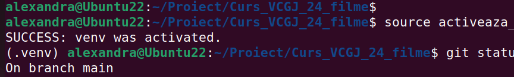
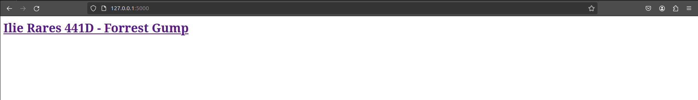
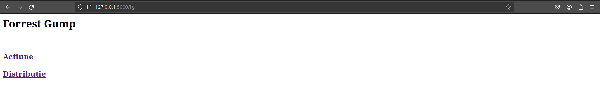
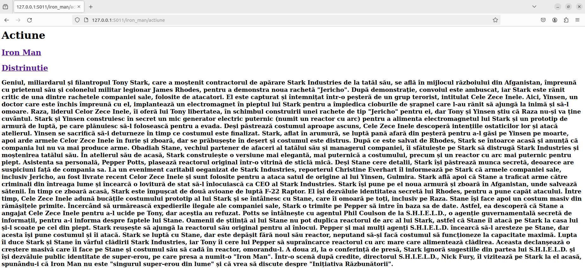
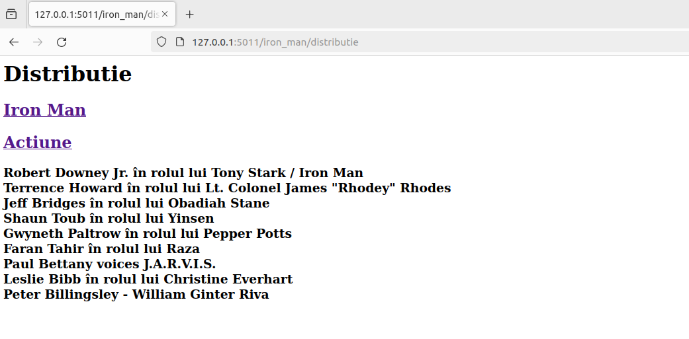
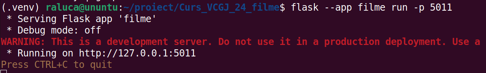
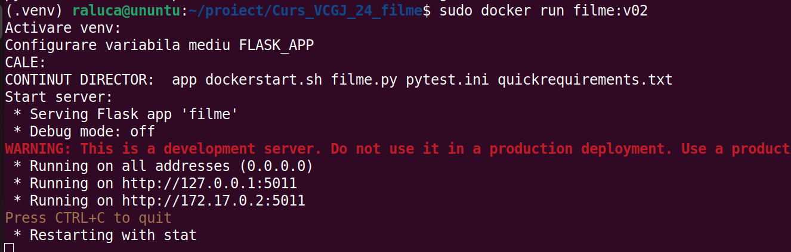
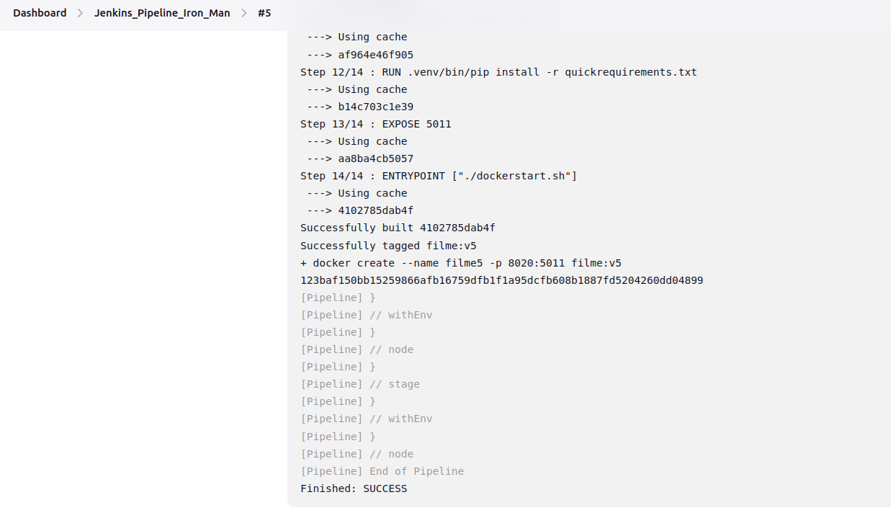

> # Descriere aplicatie
O pagină web care prezintă filmul Forrest Gump.

> # Configurare
Configurare .venv si instalare pachete

In directorul curent rulati comenzile:
* activeaza_venv: Incearca sa activeze venv-ul. Daca nu poate, configureaza venv-ul in directorul .venv si apoi instaleaza flask. La urmatoarea rulare, va activa doar venv-ul.
  

> # Pagina web

> # Utilizare Docker
> Creare imagine
> 
> `sudo docker build -t filme:v02 .`
> 
> `sudo docker images`

> Rulare container
>
> `sudo run filme:v02`
>

> # Jenkins Pipeline 

