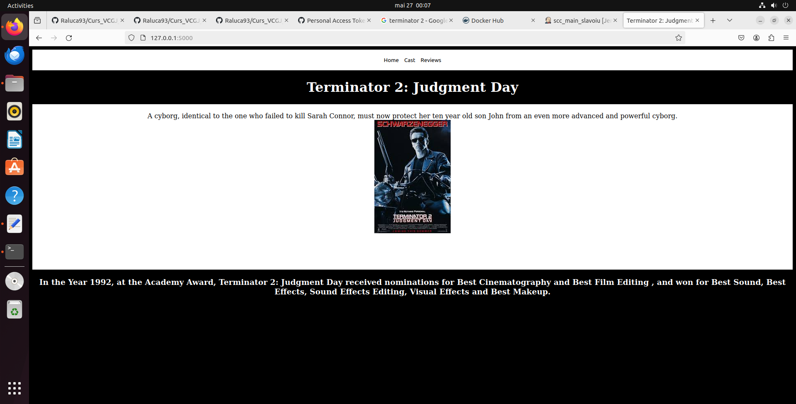
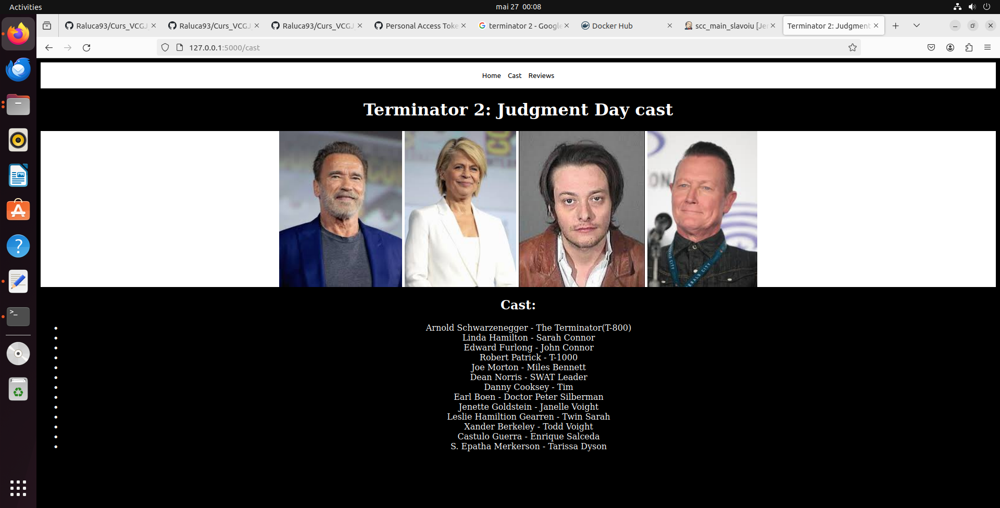
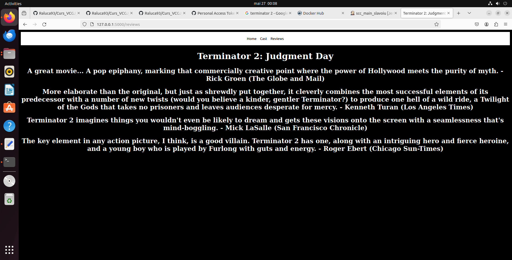
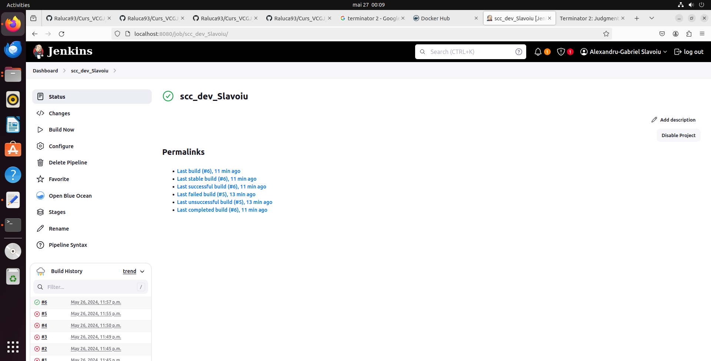
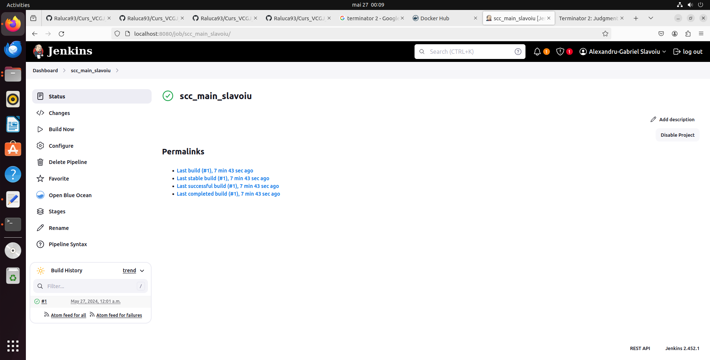

# Curs_VCGJ_24_filme-Slavoiu_Alexandru-441D
# Cuprins
1. [Descriere aplicatie](#descriere-aplicatie)
2. [Structura aplicatie](#structura-aplicatie)
3. [Docker](#docker)
4. [Jenkins](#jenkins)

> # Descriere aplicatie
  Tema proiectului propune realizarea unei aplicatii web care sa prezinte informatii specifice legate de un film la alegere. Filmul ales de mine este Interstellar, structura aplicatiei web fiind descrisa mai jos.

> # Structura aplicatie
  Aplicatia web este alcatuita din 3 pagini, fiecare oferind informatii specifice despre filmul ales.
  * Pagina Home - o scurta descriere a filmului alaturi de poster si o scurta trecere in revista a principalelor nominalizari si premii obtinute
    
    

  * Pagina Cast - o serie de portrete ale principalilor actori si, mai jos, o lista detaliata a rolurilor jucate in film

    

  * Pagina Reviews - o selectie de recenzii asupra filmului

    

> # Docker
  Pentru etapa de containerizare a fost utilizat software-ul _Docker_. Am creat un container, am adaugat un tag pentru imagine si am urcat containerul pe _Docker Hub_ folosind o serie de comenzi specifice prezentate in cadrul cursului de SCC.
>  `sudo docker build -t proiectscc:v01 .`
> 
>  `sudo docker login`
> 
>  `sudo docker tag proiectscc:v01 alexslavoiu/proiectscc:v01`
> 
>  `sudo docker push alexslavoiu/proiectscc:v01`

    

  In aceasta poza arat faptul ca am avut succes in realizarea unui container in Docker.

> # Jenkins
  In aceasta etapa, testele au fost realizate utilizand serverul de automatizare _Jenkins_. Mai jos sunt atasate cateva capturi de ecran ce surprind rezultatele obtinute in urma procesului de testare.
  
  
  
  
  

    
