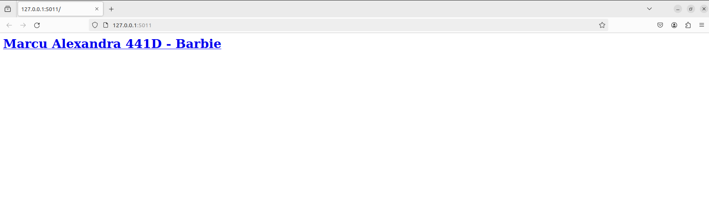
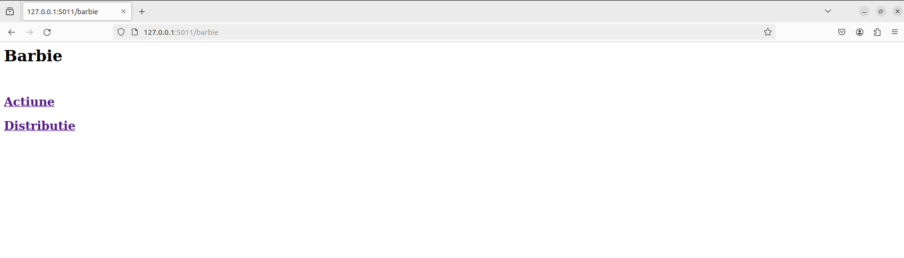
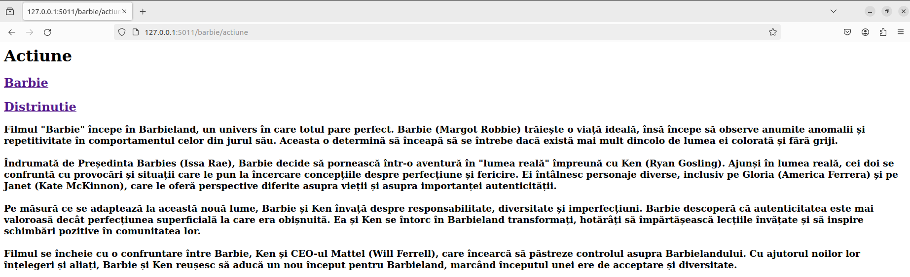
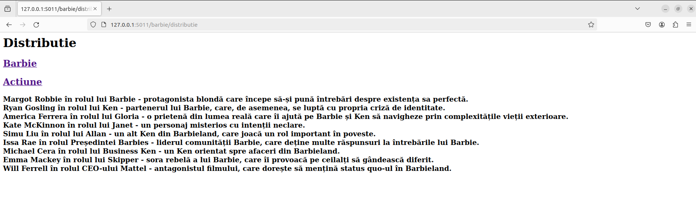
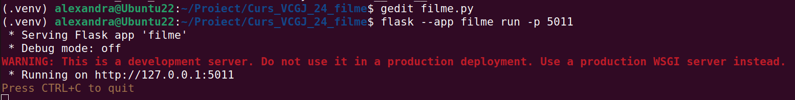
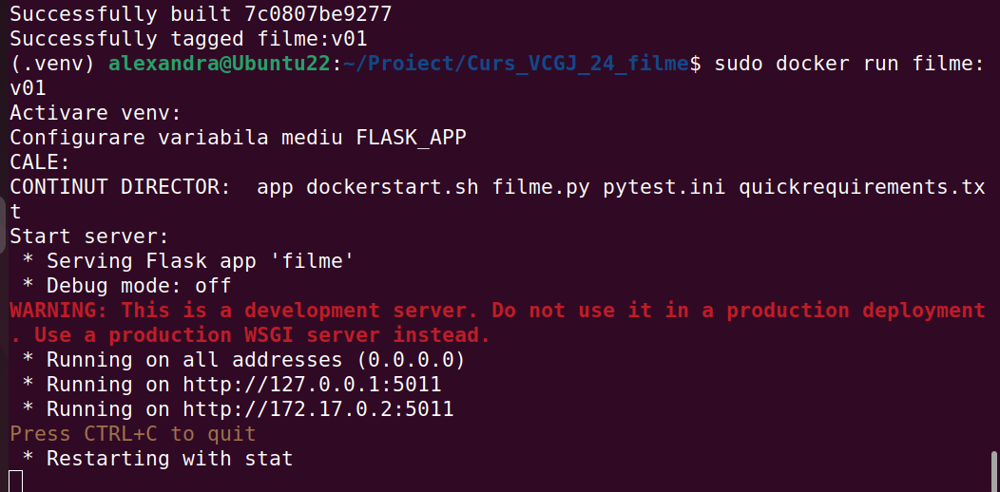
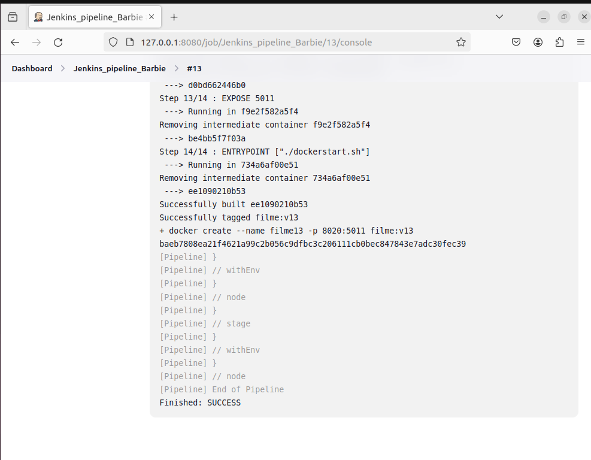

# filme
# Cuprins
1. [Descriere aplicatie](#descriere_aplicatie)
2. [Configurare](#configurare)
3. [Pagina web](#pagina_web)
4. [Utilizare Docker](#docker)
5. [Jenkins Pipeline](#jenkins)

> ## Descriere aplicatie
O pagină web care prezintă filmul Iron Man.

> ## Configurare
Configurare .venv si instalare pachete

In directorul curent rulati comenzile:
* activeaza_venv: Incearca sa activeze venv-ul. Daca nu poate, configureaza venv-ul in directorul .venv si apoi instaleaza flask. La urmatoarea rulare, va activa doar venv-ul.
  

> ## Pagina web

> ## Utilizare Docker
> Creare imagine
> 
> sudo docker build -t filme:v01 .
> 
> sudo docker images

> Rulare container
>
> sudo run filme:v01
>

> ## Jenkins Pipeline

