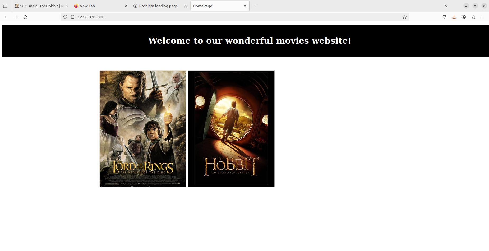
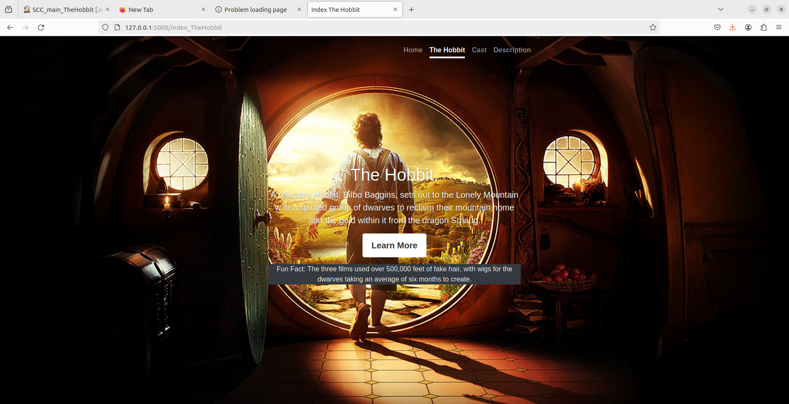
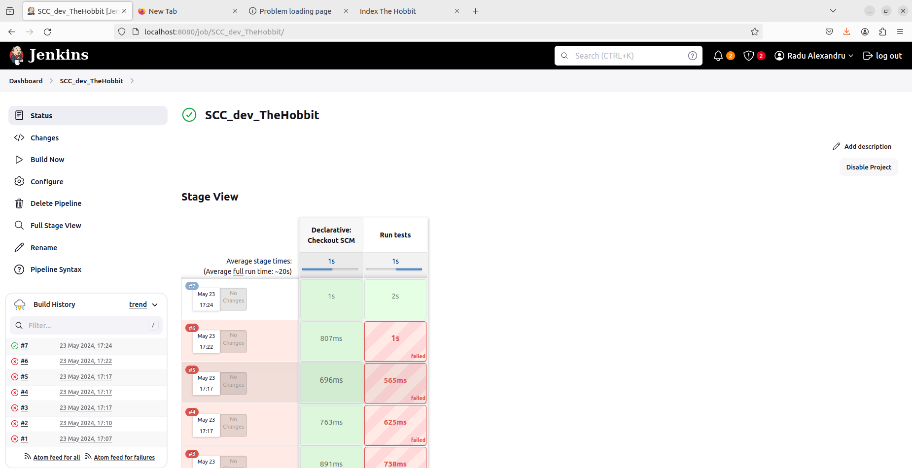

# Curs_VCGJ_24_filme

=========================

# Cuprins

1.[Descrierea Aplicatiei](#descriere-aplicatie)
2.[Configurare](#configurare)
3.[Pytest](#pytest)
4.[Pylint](#pylint)
5.[Exemple Pagini si Aplicatii](#exemple-pagini-si-aplicatii)
6.[Probleme si Bug-uri](#probleme-si-buguri)

## Descrierea Aplicatiei

Platforma de prezentare a filmelor este o aplicație unde studenții pot selecta și vizualiza diverse filme. Este compatibilă doar cu sistemul de operare Linux și a fost testată cu succes pe distribuția Ubuntu 22.04. Partea de interfață web a aplicației este construită folosind framework-ul Flask.

Arhitectura aplicației este simplă, bazată pe un model MVC (Model-View-Controller), unde fișierul filme.py gestionează afișarea template-urilor HTML. Elemente precum descrierea filmului, rating-ul sau distribuția sunt generate dinamic de funcții Python dedicate, aflate în directorul app/lib.

Pentru a facilita navigarea, pagina principală conține link-uri către alte pagini, fiecare dedicată unui film specific. De asemenea, aplicația este containerizată, fișierul Dockerfile din directorul principal asigurând suportul pentru acest lucru.

Din perspectiva testării, sunt incluse teste unitare folosind pytest pentru anumite funcții din biblioteca aplicației, găzduite în directorul app/lib.

În cadrul procesului de dezvoltare și integrare continuă (CI), este definit un pipeline pentru Jenkins în fișierul Jenkinsfile. Acest pipeline include clonarea codului sursă, crearea și activarea unui mediu virtual de lucru (venv) și rularea testelor (teste unitare cu pytest și verificări statice cu pylint).

## Configurare

1. **Activează `.venv`**:
   - În directorul `app`, rulam comanda:
     ```
     activeaza_venv
     ```
   - Această comandă încearcă să activeze mediul virtual (`venv`). Dacă acest lucru nu este posibil, va configura un nou mediu virtual în directorul `.venv` și va instala `Flask` și `Flask-Bootstrap`. La următoarea rulare, va activa direct mediul virtual existent.

2. **Rulare aplicație**:
   - Ne asiguram că mediul virtual (`venv`) este activat.
   - Executam comanda:
     ```
     ruleaza_aplicatia
     ```
   - Această comandă va porni serverul pe IP-ul `127.0.0.1` și portul `5000`.

3. **Accesare server din browser**:

Deschidem un browser web și introducen adresa următoare în bara de adrese: 
http://127.0.0.1:5000

## Pytest

Pentru a testa anumite functii din cadrul aplicatiei noastre folosim teste de tip unitate (Unit Test). Aceste teste sunt asociate cu fișierele din directorul lib, cum ar fi funfact_TheHobbit.py și year_TheHobbit.py. În teste, fiecare funcție este apelată cu anumite date, iar rezultatul este comparat cu o valoare așteptată. Testul este marcat ca trecut (PASS) dacă valoarea returnată de funcție corespunde cu valoarea așteptată, iar în caz contrar, este marcat ca eșuat (FAIL).

Pentru a efectua aceste teste, s-a folosit pachetul pytest din Python, care este inclus în lista de pachete necesare, specificată în fișierul quickrequirements.txt. Pentru a rula testele, puteți folosi oricare dintre următoarele comenzi, apelate din directorul aplicației (sysinfo):

	pytest
   	python -m pytest
   	
## Pylint

Pylint este un pachet Python folosit pentru a evalua calitatea codului, identificând probleme precum utilizarea incorectă a spațiilor, numirea inadecvată a variabilelor sau variabilele neutilizate. În acest context, rezultatele generate de pylint sunt doar afișate, nu sunt considerate erori.

## Exemple Pagini si Aplicatii





## Probleme si Bug-uri

La ultima rulare a aplicatiei si aplicatiilor aferente proiectului nu au existat dificultati. Pe parcursul realizari cerintelor am mai intampinat mici probleme, dar le-am rezolvat.
